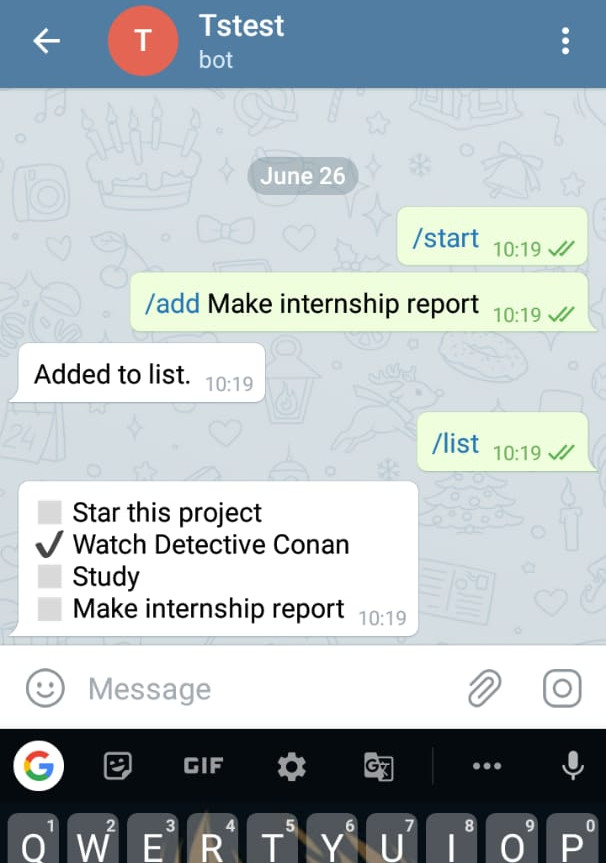
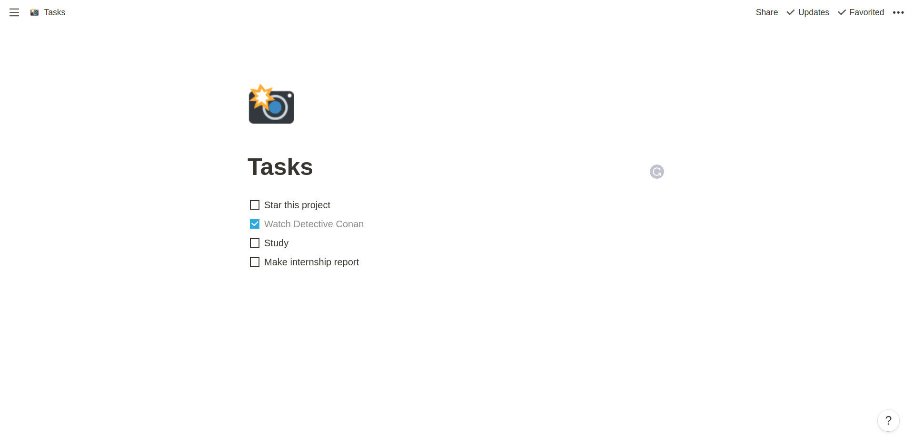

# todo-notion-telegram

A telegram bot that adds and gets items from a [Notion](https://www.notion.so/) page. Made using [node-telegram-bot-api](https://github.com/yagop/node-telegram-bot-api/) and [notion-sdk-js](https://github.com/makenotion/notion-sdk-js).

Telegram Bot               |  Notion Page    
:-------------------------:|:-------------------------:
  |  


## Installation


```bash
npm i
```

## Get tokens

1. Create a new a telegram bot using [BotFather](https://core.telegram.org/bots#6-botfather)
2. From the [Getting Started with Notion API](https://developers.notion.com/docs) guide, finish step 1
3. On the notion page, create a Todo list and copy the [blockID](https://stackoverflow.com/questions/67618449/how-to-get-the-block-id-in-notion-api).

Store all three tokens list the format in `.example.env` file and rename it as `.env`


## Usage

```node
npm run dev
```

## Commands
1. `/help`: List all commands
2. `/list`: Show all items
3. `/add item`: Add _item_
4. `/done <item number>`: Tick off _item_
4. `/clear`: Clear all items

## Contributing
Pull requests are welcome. For major changes, please open an issue first to discuss what you would like to change.

## License
[MIT](https://choosealicense.com/licenses/mit/)
